# Working with spatial data for the web

## Introduction

This workshop is designed to be very hands-on, with many examples that can be
extended as exercises. It would be impossible to touch everything that we could
find [interesting in web mapping](https://hi.stamen.com/an-ode-to-d3-js-projections-9d6477d6da0b#.1hr10rltk),
so the hope is that after going through these three acts you will feel empowered
to swap in your own data and leverage [hundreds of examples](http://blockbuilder.org/search#api=d3.geo.path) in your own data visualization projects!

## Tools

This workshop will cover a collection of Javascript mapping libraries. By the end, you will gain
hands-on experience with each library. We will see first-hand which tool is best for the
job in a variety of different situations.

* [Leaflet](http://leafletjs.com)
* [Mapbox-gl](https://www.mapbox.com/mapbox-gl-js/examples/)
* [d3.js](http://d3js.org)
* [turf.js](http://turfjs.org/)

# Act I: fundamentals
_I've got the whole world, in my hands_

This first part of the workshop will focus on understanding the data and quickly getting something on the screen.

## Data

First things first: we will play with basic GeoJSON on [geojson.io](http://geojson.io) to develop intuition for spatial data.
We can look at [this example](http://blockbuilder.org/enjalot/9a51c6ef89a3625684bf) to get a relative sense of the "size" of one degree of longitude or latitude.  

We will use a collection of datasets curated to cover a variety of locations and scales (world-wide
down to city-level) in the workshop.  This way, you won't feel confined to one geographic area
while practicing your new web-mapping skills. Each data folder contains a README that describes where the
data comes from and how it was processed:

[World data files](data/world)  
[UK (London) data files](data/UK)  
[USA (SF) data files](data/USA)

We will explore the three basic GeoJSON data types with these files:  
* Polygons - Administrative boundaries like countries, states, and counties
* Lines - Roads, Routes and Rivers
* Points - Cities, Subway stations

You can find the commands used to process and convert the data in each folder.
If you want to convert your own spatial data from one file type to another, you may want to start with
[Mapshaper](http://www.mapshaper.org/) before diving into the world of command line tools like [ogr2ogr](http://www.gdal.org/ogr2ogr.html).

I recommend reading [More than you ever wanted to know about GeoJSON](http://www.macwright.org/2015/03/23/geojson-second-bite.html)
before the workshop.  It's a concise overview and a great reference.

### Leaflet
**[1) Getting started with Leaflet](https://github.com/enjalot/wwsd/issues/1)**  
[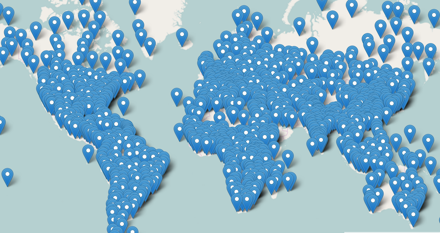](https://github.com/enjalot/wwsd/issues/1)

**[2) Basic styling & interaction](https://github.com/enjalot/wwsd/issues/2)**  
[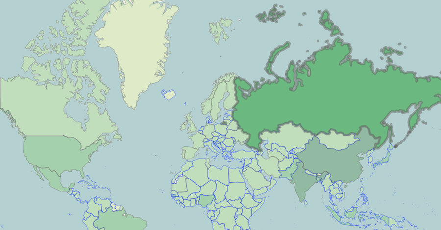](https://github.com/enjalot/wwsd/issues/2)

### Mapbox-gl

**[3) Getting started with Mapbox-gl](https://github.com/enjalot/wwsd/issues/3)**  
[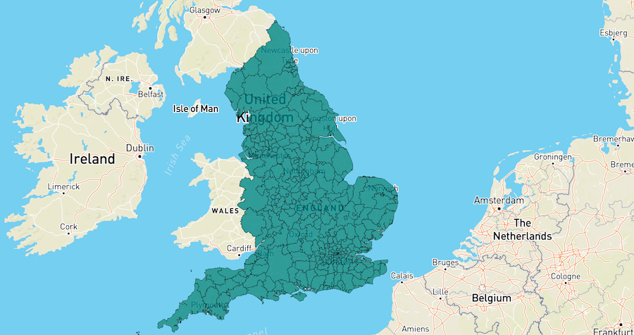](https://github.com/enjalot/wwsd/issues/3)

**[4) Basic styling & interaction](https://github.com/enjalot/wwsd/issues/4)**  
[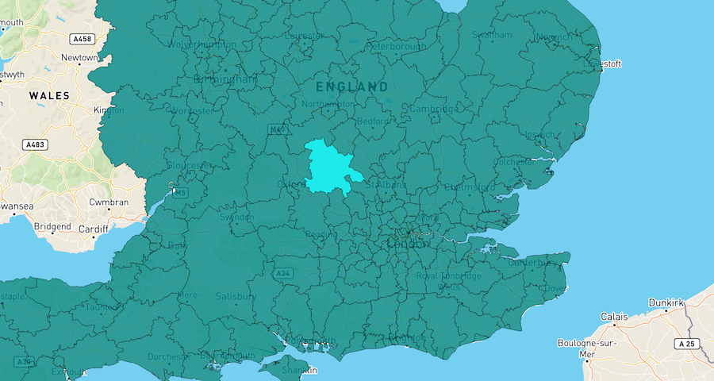](https://github.com/enjalot/wwsd/issues/4)

# Act II: d3.js
_Data driven_  

This second part of the workshop will focus on understanding projections and using them
with [d3](http://d3js.org) to render custom data-driven maps.

## Projections
[Map projections](https://en.wikipedia.org/wiki/Map_projection) are an important concept, and we need at least a basic grasp
of how they work to make the kinds of [custom maps](https://hi.stamen.com/an-ode-to-d3-js-projections-9d6477d6da0b#.bemxsm2j1) we'd like to with d3.  

One point we need to emphasize is that projections introduce distortion,
to get a sense for how different projections distort the geometry of the earth play with [this example](http://blockbuilder.org/enjalot/bd552e711b8325c64729):  
  
A fun modification using images to show distortion:  
  
And a [gratuitous animation](http://blockbuilder.org/enjalot/27969219a945e2bd20dc) with a particularly interesting projection.

If you want to understand projections from a fundamental level, checkout this [thorough presentation](http://lyzidiamond.com/geodesy-pt-1/#0) on where projections come from.

## Rendering with d3.js

**[5) SVG Paths](https://github.com/enjalot/wwsd/issues/5)**  
[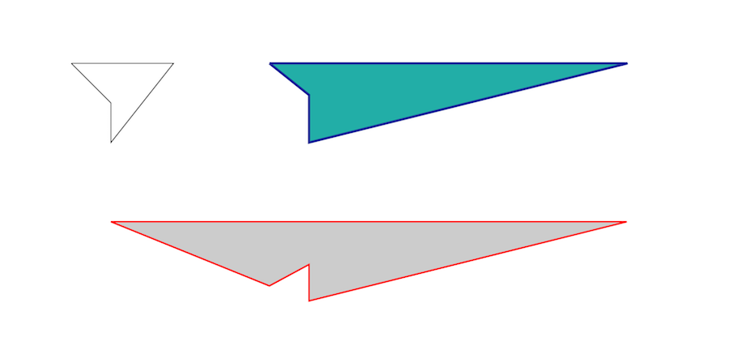](https://github.com/enjalot/wwsd/issues/5)

**[6) Rendering a map with d3 projections](https://github.com/enjalot/wwsd/issues/6)**   

**[7) Mouse interactions with d3 + SVG](https://github.com/enjalot/wwsd/issues/7)**  
[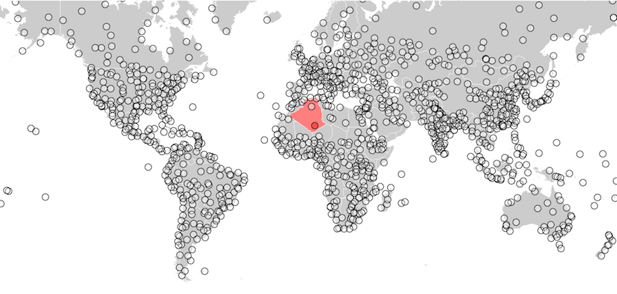](https://github.com/enjalot/wwsd/issues/7)

**[8) Data lookups](https://github.com/enjalot/wwsd/issues/8)**  
[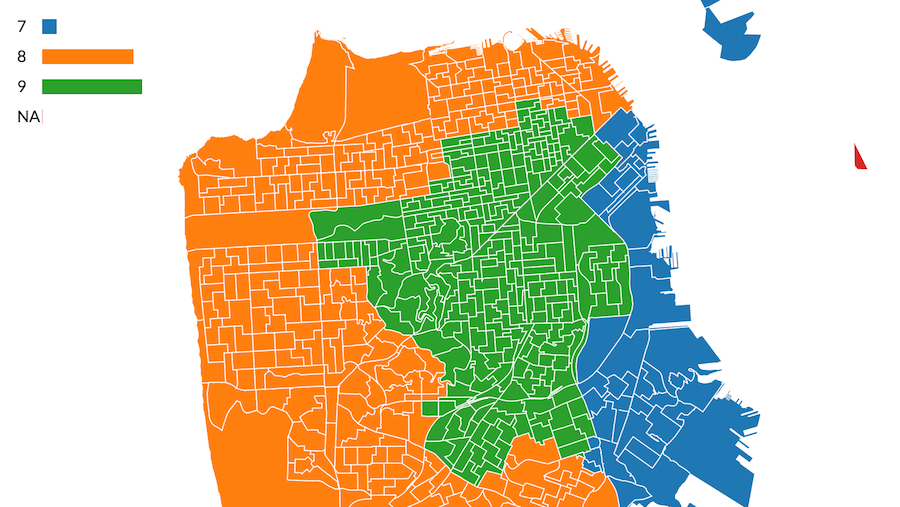](https://github.com/enjalot/wwsd/issues/8)

### Advanced d3.js usage

**[9) Zooming with d3](https://github.com/enjalot/wwsd/issues/9)**  
[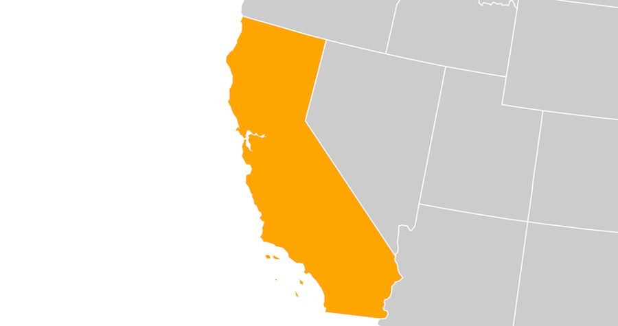](https://github.com/enjalot/wwsd/issues/9)

**[10) Leaflet SVG Overlay](https://github.com/enjalot/wwsd/issues/10)**  
[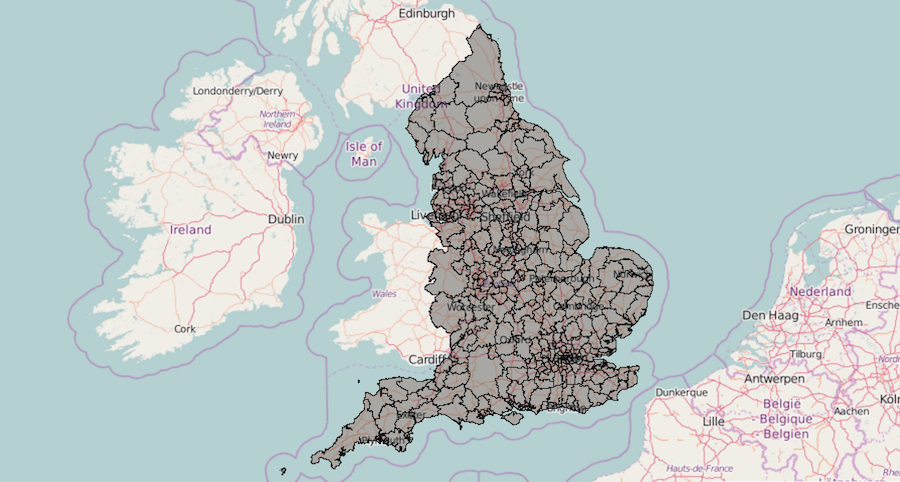](https://github.com/enjalot/wwsd/issues/10)

**[11) Mapbox-gl SVG Overlay](https://github.com/enjalot/wwsd/issues/11)**

[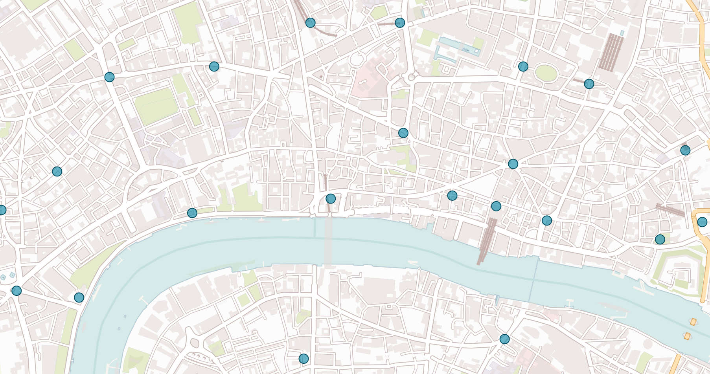](https://github.com/enjalot/wwsd/issues/11)

# Act III: performance
_Hella data_  

This part of the workshop will focus on how we can render our maps with better performance.
We can utilize an extension of GeoJSON called [TopoJSON](https://github.com/mbostock/topojson) as well as other rendering techniques like using the [Canvas API](https://developer.mozilla.org/en-US/docs/Web/API/Canvas_API).

### TopoJSON
[TopoJSON](https://github.com/mbostock/topojson) is an extension of GeoJSON that encodes topology. One of the biggest benefits of this is
that file sizes can be significantly smaller.

A couple tools that can be used to orient yourself with TopoJSON files:  
[Inspect TopoJSON](http://blockbuilder.org/enjalot/63d06e2ccadad0cb30dc5f920efd1cdf)   
[Preview TopoJSON](http://blockbuilder.org/enjalot/fe2a8ee0ad59a58ce295f035419d9e63)  

**[12) Rendering a map with d3 + TopoJSON + SVG](https://github.com/enjalot/wwsd/issues/12)**  
[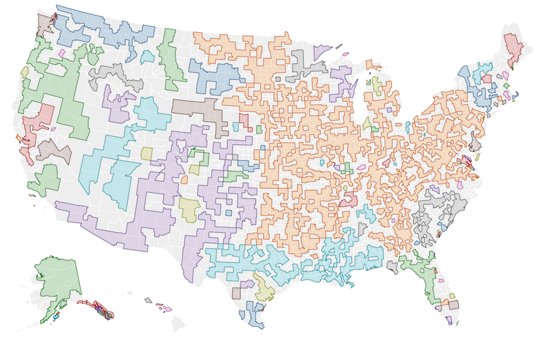](https://github.com/enjalot/wwsd/issues/12)

### Canvas
[Canvas](https://developer.mozilla.org/en-US/docs/Web/API/Canvas_API) is an HTML5 API for drawing pixel based images in the browser with Javascript.
It is possible to render lots of data quicker with canvas than SVG, but it is less convenient for interaction.

**[13) Rendering with d3 + Canvas](https://github.com/enjalot/wwsd/issues/13)**  
[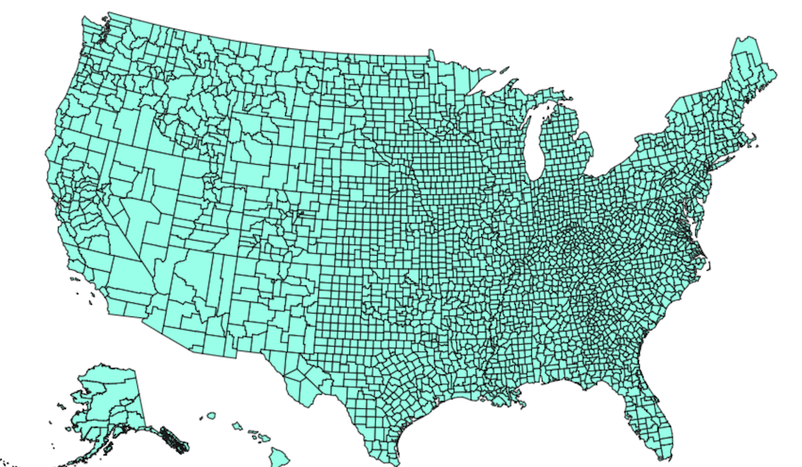](https://github.com/enjalot/wwsd/issues/13)

**[14) Zooming with Canvas](https://github.com/enjalot/wwsd/issues/13)**  
[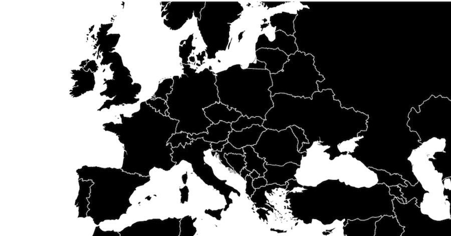](https://github.com/enjalot/wwsd/issues/14)

**[15) Mapbox-gl Canvas Overlay](https://github.com/enjalot/wwsd/issues/13)**  
[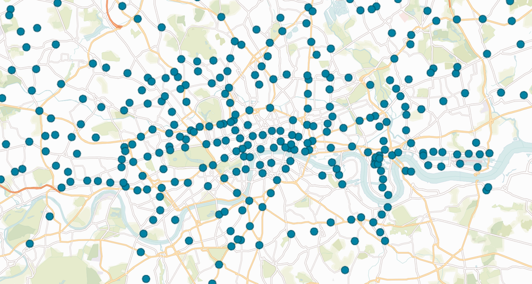](https://github.com/enjalot/wwsd/issues/15)

## turf.js

[TurfJS](http://turfjs.org) is a Javascript library for geospatial calculations and analysis.
It provides many features which can come in handy when dealing with spatial data.

**[16) Measuring areas and lengths]()**  
[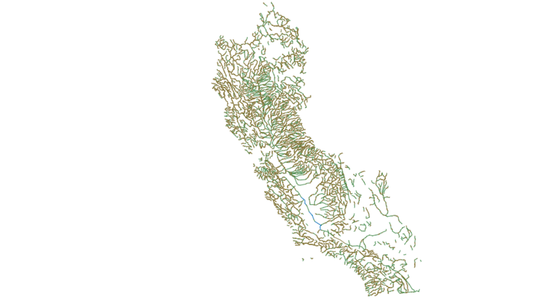](https://github.com/enjalot/wwsd/issues/16)

**[17) Buffering and contracting features]()**  
[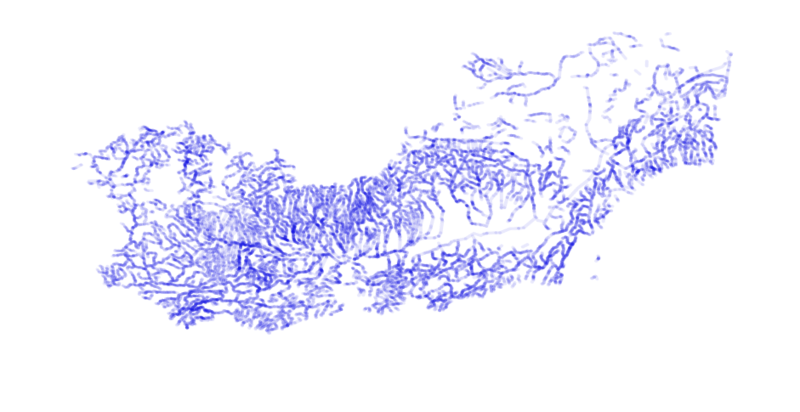](https://github.com/enjalot/wwsd/issues/17)

# Encore: advanced techniques
We may not have time to explore these examples in depth, but they should provide
inspiration and exercises for those who wish to venture deeper into the technical
possibilities of the tools covered in this workshop.

**It's a map, sort of**  
Using geospatial properties or locations to add context:  
For example [Circle counties](http://bl.ocks.org/mbostock/4206975),
Try doing this with the [world populations](http://enjalot.github.io/wwsd/data/world/ne_50m_admin_0_countries.topojson).  
You can calculate the centroids of each country using d3 or turf.   
[Example answer](http://blockbuilder.org/eesur/14e16ab00342ea44e46f3fa45a2bbf08)
  

**Advanced canvas interaction**   
[Selecting countries on a canvas globe](http://bl.ocks.org/syntagmatic/6645345)  
[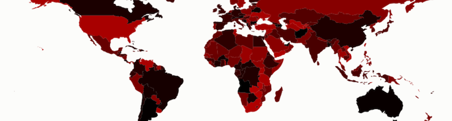](http://bl.ocks.org/syntagmatic/6645345)  

**Clipping**  
[Clipping geometry data](http://blockbuilder.org/mbostock/6301872)  
[Clipping raster tiles](http://bl.ocks.org/enjalot/985de8fcd65d37583949edbf280f2632)  
[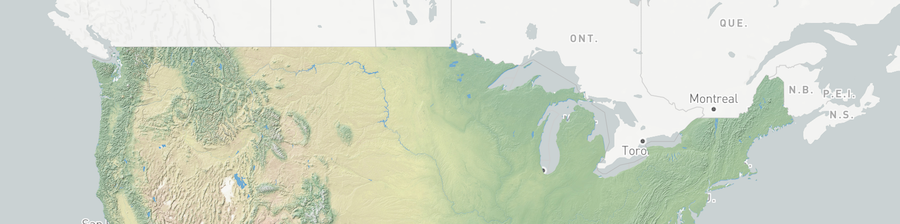](http://bl.ocks.org/enjalot/985de8fcd65d37583949edbf280f2632)  

**Voronoi**  
[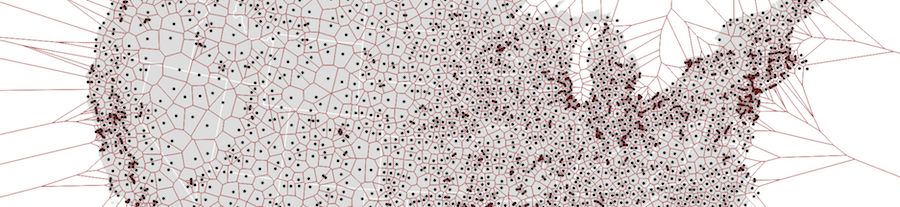](http://blockbuilder.org/mbostock/4360892)  
[More examples](http://blockbuilder.org/search#text=voronoi;api=d3.geo.path)

**Quadtrees**  
[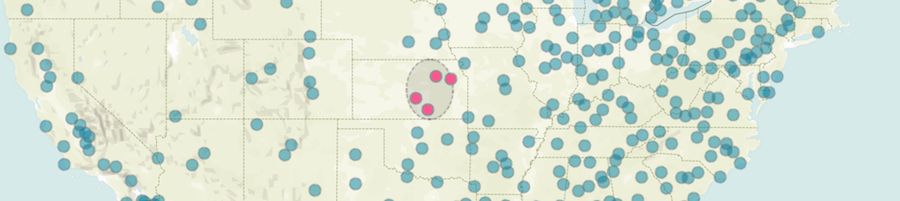](http://blockbuilder.org/enjalot/534c925aa109f526d37937dcfda58fc4)  
   

**Animated paths**  
[Timer & Mapbox-gl](http://bl.ocks.org/enjalot/4ff31e96860f38d4fd58)  
[Transitions & Canvas](http://blockbuilder.org/rveciana/502db152b70cddfd554e9d48ee23e279)  
[Point-along-path & SVG](http://blockbuilder.org/wboykinm/5689397a1236ec79c0e94a162bd4d566)
